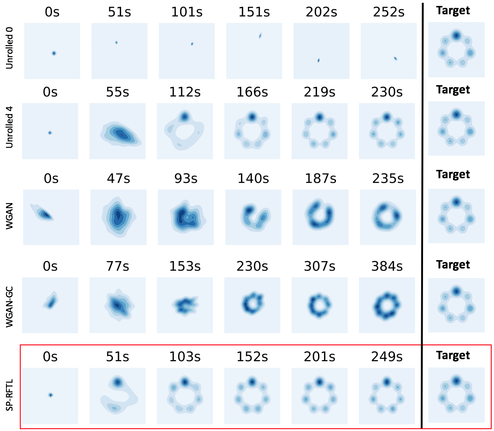

# gans-mode-collapse
Code for GAN experiments from paper the paper 'Competing Against Equilibria in Zero-Sum Games with Evolving Payoffs'.

The figure below shows a comparison of Saddle Point Follow the Leader vs other algorithms for
training GANs in a mixture of Gaussians dataset.

spftl_mix_gaussians.py contains the implementation of SP-RFTL in the paper

unrolled_mix_gaussians.py contains the implementation of Unrolled we used in the paper,
see git@github.com:poolio/unrolled_gan.git for the original code

The experiments for Wasserstein GAN and Wasserstein GAN with Gradient Clipping can be found at
git@github.com:igul222/improved_wgan_training.git
